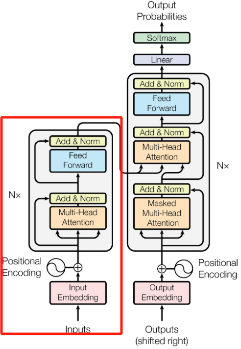
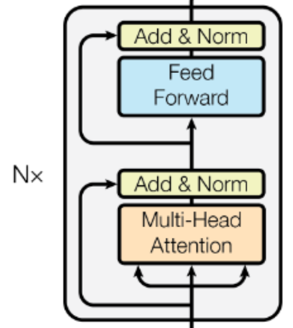

## BERT Architecture

### Total Summary

BERT的模型架构完全基于Transformer架构的编码器（Encoder）堆叠（原文使用12层或24层Transformer Layer），每个Encoder包括**多头自注意力机制**（MHA，Multi-Head Self-Attention，支持双向上下文理解）、**前馈神经网络**（FFN，Feed-Forward Network，对注意力输出进行非线性变换），**参差连接和层归一化**（Add & Norm，提升训练稳定性）。



<!--  -->

### A Simple Demo

这里以一个Huggingface发布的用于英文句子情感二分类的蒸馏BERT[DistilBERT (distilbert-base-uncased-finetuned-sst-2-english) 66M](https://huggingface.co/distilbert/distilbert-base-uncased-finetuned-sst-2-english)为例，使用transformers库实现加载并推理。

```bash
huggingface-cli download distilbert/distilbert-base-uncased-finetuned-sst-2-english --local-dir distilbert-base-uncased-finetuned-sst-2-english
```

下载模型后，即可通过`AutoTokenizer`和`AutoModelForSequenceClassification`导入模型。

```python
import torch.nn.functional as F
from transformers import AutoTokenizer, AutoModelForSequenceClassification

# 加载tokenizer和model
model_name = '/path/to/bert-model'

tokenizer = AutoTokenizer.from_pretrained(model_name)
model = AutoModelForSequenceClassification.from_pretrained(model_name)

# sentence -> tokens
test_sentences = ['today is not that bad', 'today is so bad']
batch_input = tokenizer(test_sentences, padding=True, truncation=True, return_tensors='pt')

# inference
with torch.no_grad():
    outputs = model(**batch_input)              # 解包tokens -> inference result
    print("outputs", outputs)
    scores = F.softmax(outputs.logits, dim=1)   # 对logits(预测分数)对每一行（类别）进行softmax
    print("scores", scores)
    labels = torch.argmax(scores, dim=1)        # 沿类别维度获取最大值索引
    labels = [model.config.id2label[id.item()] for id in labels]  # 0->LABEL_0, 1->LABEL_1
    print("labels", labels)
```

即可得到以下推理结果：

```bash
outputs SequenceClassifierOutput(loss=None, logits=tensor([[-3.4620,  3.6118],
        [ 4.7508, -3.7899]]), hidden_states=None, attentions=None)
scores tensor([[8.4632e-04, 9.9915e-01],
        [9.9980e-01, 1.9531e-04]])
labels ['POSITIVE', 'NEGATIVE']
```

关于`with torch.no_grad()`和`param.requires_grad=False`的区别：

+ `with torch.no_grad()`适用于eval阶段，定义了一个上下文管理器，隐式不进行梯度更新，不会改变requires_grad

+ `param.requires_grad=False`显式地frozen掉一些layer的梯度更新

接下来需要对一些细节进行补充。

#### model.config

`model.config`用于存储模型架构和训练配置。

```text
DistilBertConfig {
  "activation": "gelu",
  "architectures": [
    "DistilBertForSequenceClassification"
  ],
  "attention_dropout": 0.1,
  "dim": 768,
  "dropout": 0.1,
  "finetuning_task": "sst-2",
  "hidden_dim": 3072,
  "id2label": {
    "0": "NEGATIVE",
    "1": "POSITIVE"
  },
  "initializer_range": 0.02,
  "label2id": {
    "NEGATIVE": 0,
    "POSITIVE": 1
  },
  "max_position_embeddings": 512,
  "model_type": "distilbert",
  "n_heads": 12,
  "n_layers": 6,
  "output_past": true,
  "pad_token_id": 0,
  "qa_dropout": 0.1,
  "seq_classif_dropout": 0.2,
  "sinusoidal_pos_embds": false,
  "tie_weights_": true,
  "torch_dtype": "float32",
  "transformers_version": "4.52.3",
  "vocab_size": 30522
}
```

#### Rules on Tokenizer

调用`tokenizer`即调用`tokenizer.__call__`或`tokenizer.encoder`（不完全等价，encoder默认不返回attention_mask），将返回含有`input_ids`和`attention_mask`的输入字典（`inputs_ids`和`attention_mask`长度一致）。（具体返回什么视模型具体需要而定）

`tokenizer.encoder`的调用分为两步，先分词，再编码，所以等价于先调用`tokenizer.tokenize`再调用`tokenizer.convert_tokens_to_ids`。

在句子对编码时，使用`tokenizer.encode_plus`，在返回字典中除了`inputs_ids`和`attention_mask`，还会返回`token_type_ids`$\in \{0, 1\}$用于标记第一句话和第二句话。在tokens中，会用[SEQ]分割。

```python
# 编码
print(tokenizer(test_sentences[0]))
# tokenizer.encode = tokenizer.tokenize + tokenizer.convert_tokens_to_ids
print(tokenizer.encode(test_sentences[0],))
## tokenize
print(tokenizer.tokenize(test_sentences[0]))
## convert_tokens_to_ids
print(tokenizer.convert_tokens_to_ids(tokenizer.tokenize(test_sentences[0])))
# 解码
print(tokenizer.decode([101, 2651, 2003, 2025, 2008, 2919, 102]))

```

可以得到以下结果：

```bash
# 编码
{'input_ids': [101, 2651, 2003, 2025, 2008, 2919, 102], 'attention_mask': [1, 1, 1, 1, 1, 1, 1]}
[101, 2651, 2003, 2025, 2008, 2919, 102]
## tokenize
['today', 'is', 'not', 'that', 'bad']
## convert_tokens_to_ids
[2651, 2003, 2025, 2008, 2919]
# 解码
[CLS] today is not that bad [SEP]
```

`tokenizer`是根据`tokenizer.vocab`为依据进行编码的，以下是特殊token表（可以通过`tokenizer.special_tokens_map`或直接`tokenizer`查看），tokenizer会尽量避免将词分为[UNK]（存在5828个`##`开头的后缀子词）。

```text
{'unk_token': '[UNK]',      # 100
 'sep_token': '[SEP]',      # 102
 'pad_token': '[PAD]',      # 0
 'cls_token': '[CLS]',      # 101
 'mask_token': '[MASK]'     # 103}
```

#### Parameter

这里以Google发布的[google-bert/bert-base-uncased](https://huggingface.co/google-bert/bert-base-uncased?text=Paris+is+the+%5BMASK%5D+of+France.)（12层BertLayer）为例。

通过`model`可以看到BERT的架构如下：

+ **Embedding**由word embeddings、position embeddings和token type embedding三部分组成

+ **Encoder**由12层BertLayer组成，每层BertLayer都由一次Self Attention和一次FFN组成

+ **Pooler**全连接层

+ **Output**(optional)作为下游任务的输出层

```text
BertModel(
  (embeddings): BertEmbeddings(
    (word_embeddings): Embedding(30522, 768, padding_idx=0)
    (position_embeddings): Embedding(512, 768)
    (token_type_embeddings): Embedding(2, 768)
    (LayerNorm): LayerNorm((768,), eps=1e-12, elementwise_affine=True)
    (dropout): Dropout(p=0.1, inplace=False)
  )
  (encoder): BertEncoder(
    (layer): ModuleList(
      (0-11): 12 x BertLayer(
        (attention): BertAttention(
          (self): BertSdpaSelfAttention(
            (query): Linear(in_features=768, out_features=768, bias=True)
            (key): Linear(in_features=768, out_features=768, bias=True)
            (value): Linear(in_features=768, out_features=768, bias=True)
            (dropout): Dropout(p=0.1, inplace=False)
          )
          (output): BertSelfOutput(
            (dense): Linear(in_features=768, out_features=768, bias=True)
            (LayerNorm): LayerNorm((768,), eps=1e-12, elementwise_affine=True)
            (dropout): Dropout(p=0.1, inplace=False)
          )
        )
        (intermediate): BertIntermediate(
          (dense): Linear(in_features=768, out_features=3072, bias=True)
          (intermediate_act_fn): GELUActivation()
        )
        (output): BertOutput(
          (dense): Linear(in_features=3072, out_features=768, bias=True)
          (LayerNorm): LayerNorm((768,), eps=1e-12, elementwise_affine=True)
          (dropout): Dropout(p=0.1, inplace=False)
        )
      )
    )
  )
  (pooler): BertPooler(
    (dense): Linear(in_features=768, out_features=768, bias=True)
    (activation): Tanh()
  )
)
```

可以用以下代码计算每一部分的参数量：

```python
total_params = 0
total_learnable_params = 0
total_embedding_params = 0
total_encoder_params = 0
total_pooler_params = 0
for name, param in model.named_parameters():
    # print(name, '->', param.shape, '->', param.numel())
    # 加上`if param.requires_grad:`可以计算可学习参数量
    if 'embedding' in name:
        total_embedding_params += param.numel()
    if 'encoder' in name:
        total_encoder_params += param.numel()
    if 'pooler' in name:
        total_pooler_params += param.numel()
    if param.requires_grad:
        total_learnable_params += param.numel()
    total_params += param.numel()
params = [
    ("total_embedding_params", total_embedding_params),
    ("total_encoder_params", total_encoder_params),
    ("total_pooler_params", total_pooler_params)
]

for name, param in params:
    percentage = (param / total_params) * 100
    print(f"{name}: {percentage:.2f} %, {param}")
```

得到输出结果：

```bash
total_embedding_params: 21.77 %, 23837184
total_encoder_params: 77.69 %, 85054464
total_pooler_params: 0.54 %, 590592
```

#### Output

在`outputs = model(**input)`后调用`type(outputs)`可以发现Bert的输出类型是`transformers.modeling_outputs.BaseModelOutputWithPoolingAndCrossAttentions`。参考[Huggingface-BERT文档](https://huggingface.co/docs/transformers/model_doc/bert#transformers.BertModel)，默认情况下长度为2（`last_hidden_state`和`pooler_output`）。当定义模型时指定`output_hidden_states=True`时，还会返回`hidden_state`，其他参数类似。

+ output[0] (`last_hidden_state`), shape = (batch_size, seq_len, hidden_size)

+ output[1] (`pooler_output`), shape = (batch_size, hidden_size)

最终隐藏状态（classification token, [CLS]的输出）

+ output[2] (`hidden_states`), **tuple**, embedding layer和每个layer的输出（1+12）, shape = 13 * (batch_size, seq_len, hidden_size)

如`model.embeddings(input['input_ids'], input['token_type_ids']) == outputs[2][0]`表示Embedding层的输出。

### Embedding

上文提到，BERT的Embedding层由word embeddings、position embeddings和token type embedding三部分组成，以下代码实现了简单的Embedding层：

```python
from transformers import BertTokenizer, BertModel

tokenizer = BertTokenizer.from_pretrained("bert-base-uncased")
model = BertModel.from_pretrained("bert-base-uncased")

input = tokenizer(sentence, return_tensors='pt') # {input_ids, token_type_ids, attention_mask}
input_ids = input['input_ids']              # shape = (batch_size, token_len)
token_type_ids = input['token_type_ids']    # shape = (batch_size, token_len)
pos_ids = torch.arange(input_ids.shape[1])  # shape = (token_len)

# 1. Word Embedding
word_embed = model.embeddings.word_embeddings(input_ids)            # shape = (batch_size, token_len, embedding_size=768)

# 2. Token Type Embedding
tok_embed = model.embeddings.token_type_embeddings(token_type_ids)  # shape = (batch_size, token_len, embedding_size=768)

# 3. Position Embedding
pos_embed = model.embeddings.position_embeddings(pos_ids)           # shape = (token_len, embedding_size=768)

# **Input Embedding**
input_embed = word_embed + tok_embed + pos_embed.unsqueeze(0)       # 也可以不unsqueeze, 会broadcast的

# 后处理
embed = model.embeddings.LayerNorm(input_embed)
embed = model.embeddings.dropout(embed)
```

### Self-Attention

$$Attention(Q, K, V)=softmax(\frac{QK^{T}}{\sqrt[]{d_{k}} })V$$

接下来是从Embedding层输出到Multi-Head Self-Attention (MHA)的代码实现（first head）：

```python
att_head_size = int(model.config.hidden_size / model.config.num_attention_heads) # 768 / 12 = 64
emb_output = model.embeddings(input['input_ids'], input['token_type_ids']) # shape = (batch_size, seq_len, embedding_dim)
# emb_output[0].shape = (seq_len, embedding_dim)
## Why Transpose? 因为PyTorch中的Linear里就是x@A^T（左乘转置）
Q_first_head_first_layer = emb_output[0] @ model.encoder.layer[0].attention.self.query.weight.T[:, :att_head_size] + model.encoder.layer[0].attention.self.query.bias[:att_head_size]
K_first_head_first_layer = emb_output[0] @ model.encoder.layer[0].attention.self.key.weight.T[:, :att_head_size] + model.encoder.layer[0].attention.self.key.bias[:att_head_size]
# (seq_len, att_head_size) @ (seq_len, att_head_size).T -> (seq_len, seq_len)
attn_scores = torch.nn.Softmax(dim=-1)(Q_first_head_first_layer @ K_first_head_first_layer.T) / math.sqrt(att_head_size)

V_first_head_first_layer = emb_output[0] @ model.encoder.layer[0].attention.self.value.weight.T[:, :att_head_size] + model.encoder.layer[0].attention.self.value.bias[:att_head_size]
attn_emb = attn_scores @ V_first_head_first_layer # shape = (seq_len, att_head_size)
```

接下来是关于MHA的公式推导，定义$E$为Embedding层的输出$q$、$k$、$v$分别为同一token对应的query、key、value，$W_q$、$W_k$、$W_v$分别为同一token的权重，$Q$、$K$、$V$分别为整个序列的query、key、value，$W_Q$、$W_K$、$W_V$分别为整个序列的权重。这里省略bias项。

先从某一token出发，$T$表示序列长度，$d_e$表示Embedding层维度，$d_q$、$d_k$、$d_v$分别表示q、k、v的维度，$E \in \mathbb{R}^{T \times d_e}$，那么：

$$E \cdot W_q = q \in \mathbb{R}^{T \times d_q}$$

$$E \cdot W_k = k \in \mathbb{R}^{T \times d_k}$$

$$E \cdot W_v = v \in \mathbb{R}^{T \times d_v}$$

其中$d_q == d_k$，因为后续需要计算$q \cdot k^{T}$，$d_v$则没有要求：

$$Attention\ Score = Softmax(\frac{q \cdot k^{T}}{\sqrt{d_k}}) \in \mathbb{R}^{T \times T}$$

$$Attention\ Output = Softmax(\frac{q \cdot k^{T}}{\sqrt{d_k}}) \cdot v \in \mathbb{R}^{T \times d_v}$$

接下来定义Attention头数为$n$，将单头的情况拓展到多头：

\[
\left[
\begin{array}{c|c|c|c}
  E\cdot W_{q_1} & E\cdot W_{q_2} & ... & E\cdot W_{q_n} \\
\end{array}
\right]=E\cdot \left[
\begin{array}{c|c|c|c}
  W_{q_1} & W_{q_2} & ... & W_{q_n} \\
\end{array}
\right]=E\cdot W_Q=Q \in \mathbb{R}^{T \times n\cdot d_q}
\]

\[
\left[
\begin{array}{c|c|c|c}
  E\cdot W_{k_1} & E\cdot W_{k_2} & ... & E\cdot W_{k_n} \\
\end{array}
\right]=E\cdot \left[
\begin{array}{c|c|c|c}
  W_{k_1} & W_{k_2} & ... & W_{k_n} \\
\end{array}
\right]=E\cdot W_K=K \in \mathbb{R}^{T \times n\cdot d_k}
\]

\[
\left[
\begin{array}{c|c|c|c}
  E\cdot W_{v_1} & E\cdot W_{v_2} & ... & E\cdot W_{v_n} \\
\end{array}
\right]=E\cdot \left[
\begin{array}{c|c|c|c}
  W_{v_1} & W_{v_2} & ... & W_{v_n} \\
\end{array}
\right]=E\cdot W_V=V \in \mathbb{R}^{T \times n\cdot d_v}
\]

那么就可以得到完整的MHA了：

$$Attention(Q, K, V)=softmax(\frac{QK^{T}}{\sqrt[]{d_{k}} })V \in \mathbb{R}^{T \times n \cdot d_v}$$

### Add & Norm



<!--  -->

在Encoder中共有两次参差连接和层归一化（Add & Norm），第一次发生在MHA中：

```python
layer = model.encoder.layer[0]    # First Layer
embeddings = model(**input)[2][0] # Embeddings Layer Output
mha_output = layer.attention.self(embeddings)
attn_output = layer.attention.output(mha_output[0], embeddings)
```

第二次发生在MLP中：

```python
mlp1 = layer.intermediate(attn_output) # shape = (batch_size, seq_len, 4x768)
mlp2 = layer.output.output(mlp1, attn_output) # 这个结果和output[2][1]是相同的（layer 1的输出结果）
```

`Add & Norm`的实现很简单，如下：

```python
def forward(self, hidden_states, input_tensor):
  hidden_states = self.dense(hidden_states)
  hidden_states = self.dropout(hidden_states)
  hidden_states = self.LayerNorm(hidden_states + input_tensor)
  return hidden_states
```

### Pooler

对于`output = model(**input)`，一般有两个keys，即`last_hidden_state`(shape=(batch_size, seq_len, emb_dim))和`pooler_output`(shape=(batch_size, emb_dim))。

其中`pooler_output`少了seq_len的维度，观察BERT源码可以发现，`pooler_output`是BERT encoder只对第一个token（也就是[CLS]）进行了一次全连接和激活的输出。

```python
def forward(self, hidden_states):
  # We "pool" the model by simply taking the hidden state corresponding
  # to the first token.
  first_token_tensor = hidden_states[:, 0] # 第一个元素的hidden_states
  pooled_output = self.dense(first_token_tensor)
  pooled_output = self.activation(pooled_output)
  return pooled_output
```

也可以翻译为以下代码：

```python
first_sentence = output['last_hidden_state'][0]
pool_output = bert.pooler.dense(first_sentence[0, :])
pool_output = bert.pooler.activation(pool_output)
```

下面的图可以清晰地诠释这一过程：



这一Pooler Layer可以视为BERT的一个默认head，作为最后BERT的输出。在不同的任务下，一般保留同样的Embedding Layer和中间Layer，只替换最后这一部分。

## Masked Language Model

掩码语言模型（MLM, Masked Language Model）是BERT的一种自监督学习任务，模型的目标是预测输入文本中被随机覆盖（masked）的token（完形填空）。当我们使用`BertForMaskedLM`加载模型后，观察配置（主要关注最后一层）。

### CLS Layer

BERT（base）的最后一层是上一节提到的简单的Pooler Player：

```text
(pooler): BertPooler(
  (dense): Linear(in_features=768, out_features=768, bias=True)
  (activation): Tanh()
)
```

而BERT（MLM）的最后一层是一个略微复杂一些的CLS Layer，由transform（全连接+激活+层归一化）和decoder（全连接）两个运算构成：

```text
(cls): BertOnlyMLMHead(
  (predictions): BertLMPredictionHead(
    (transform): BertPredictionHeadTransform(
      (dense): Linear(in_features=768, out_features=768, bias=True)
      (transform_act_fn): GELUActivation()
      (LayerNorm): LayerNorm((768,), eps=1e-12, elementwise_affine=True)
    )
    (decoder): Linear(in_features=768, out_features=30522, bias=True)
  )
)
```

经过`self.transform`运算后，仍然保持shape=(batch_size, seq_len, emb_dim=768)，作用仅仅是做一次同样维度的全连接激活；`self.decoder`也只是一个简单的全连接，将768维映射到vocab_size=30522维（多分类任务）。

### Masking

既然是监督学习，就需要制作Label了。以下代码可以对经过tokenizer的文本进行随机mask并加入label标记原始文本：

```python
inputs = tokenizer(text, return_tensors='pt')
inputs['labels'] = inputs['input_ids'].detach().clone()

# 生成掩码矩阵（序列）
mask_arr = (torch.rand(inputs['input_ids'].shape) < 0.15) * (inputs['input_ids'] != 101) * (inputs['input_ids'] != 102)
# 筛选掩码列表
selection = torch.flatten(mask_arr[0].nonzero()).tolist()
# 随机mask
inputs['input_ids'][0, selection] = tokenizer.vocab['[MASK]'] # or 103
```

### Computing Process

与Base模型的Pooler Layer将最后一层的第一个token的隐藏状态作为输入不同，MLM将最后一层的所有隐藏状态作为输出，即`mlm_output = mlm.cls(outputs['hidden_states'][-1])`。实际上就是这么个流程：

```python
mlm.eval()
last_hidden_state = outputs['hidden_states'][-1]                    # (batch_size, seq_len, emb_dim)
with torch.no_grad():
    transformed = mlm.cls.predictions.transform(last_hidden_state)  # (batch_size, seq_len, emb_dim) still
    logits = mlm.cls.predictions.decoder(transformed)               # (batch_size, seq_len, vocab_size)
```

### Loss & Translate

`mlm(**inputs)`的返回类型是`transformers.modeling_outputs.MaskedLMOutput`，即`odict_keys(['loss', 'logits', 'hidden_states'])`。

`output.loss`是一个tensor标量，使用CrossEntropy，实现如下：

```python
ce = nn.CrossEntropyLoss()
outputs.loss = ce(logits[0], inputs['labels'][0].view(-1))
```

而翻译也很简单，使用`torch.argmax(logits[0], dim=1)`找到最大概率分数的索引即可：

```python
' '.join(tokenizer.convert_ids_to_tokens(torch.argmax(logits[0], dim=1)))
```

---

## Reference

[BERT: Pre-training of Deep Bidirectional Transformers for Language Understanding](https://arxiv.org/abs/1810.04805)

[Huggingface-BERT文档](https://huggingface.co/docs/transformers/model_doc/bert#transformers.BertModel)

[Chris McCormick's Blog](https://mccormickml.com/2019/07/22/BERT-fine-tuning/)

[动手学深度学习(PyTorch)](https://zh.d2l.ai/chapter_attention-mechanisms/transformer.html)

[bilibili-五道口纳什-BERT、T5、GPT合集](https://search.bilibili.com/all?vt=69025821&keyword=%E4%BA%94%E9%81%93%E5%8F%A3%E7%BA%B3%E4%BB%80&from_source=webtop_search&spm_id_from=333.1007&search_source=5)

> 学习BERT时在五道口纳什的频道收益良多，《动手写BERT》系列教程非常适合对LLM有一定认识但缺乏实践经验的入门者学习参考。