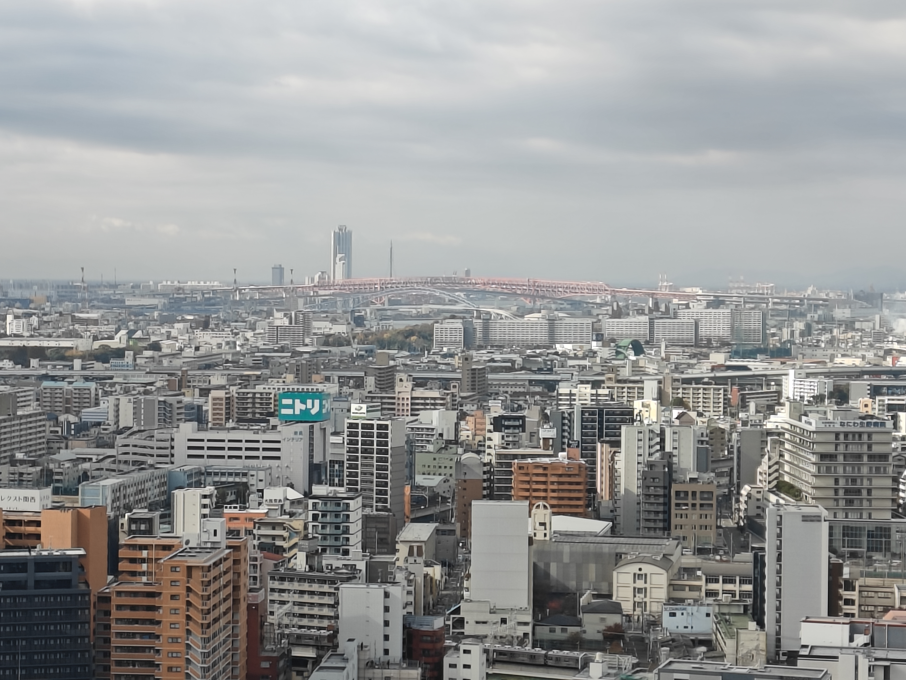
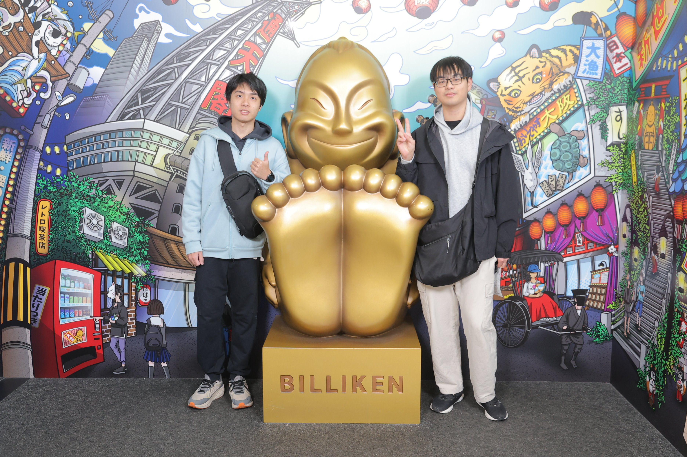
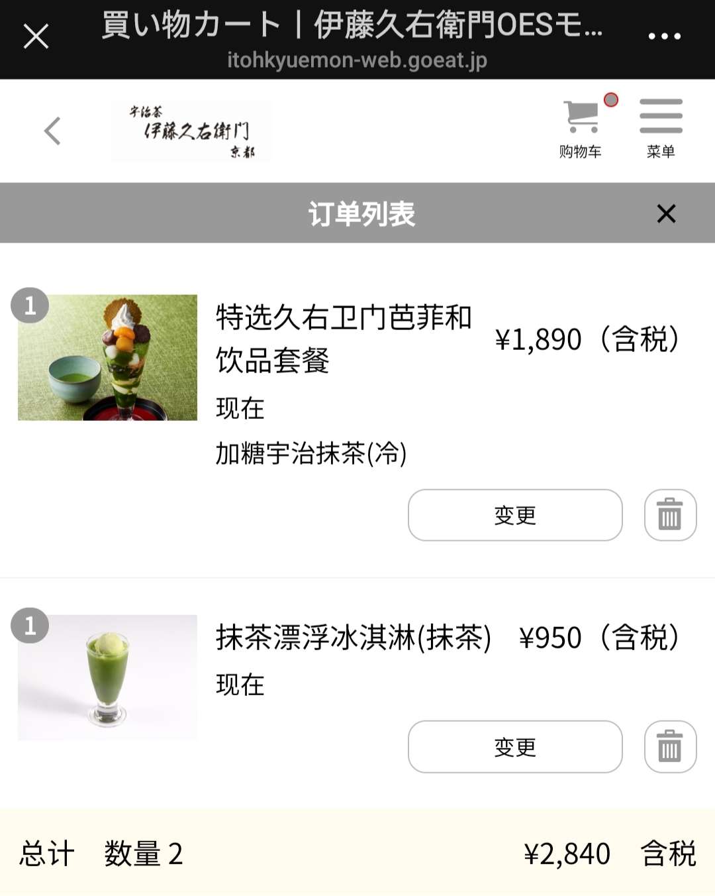
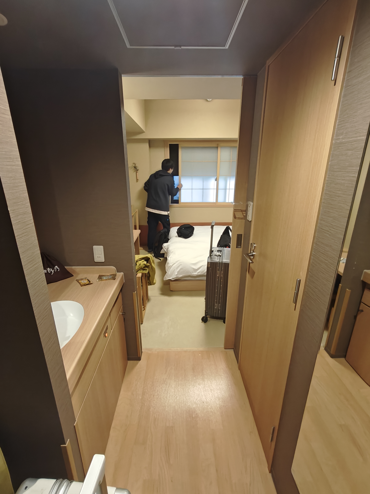
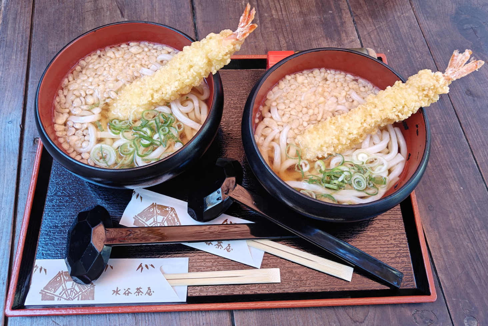
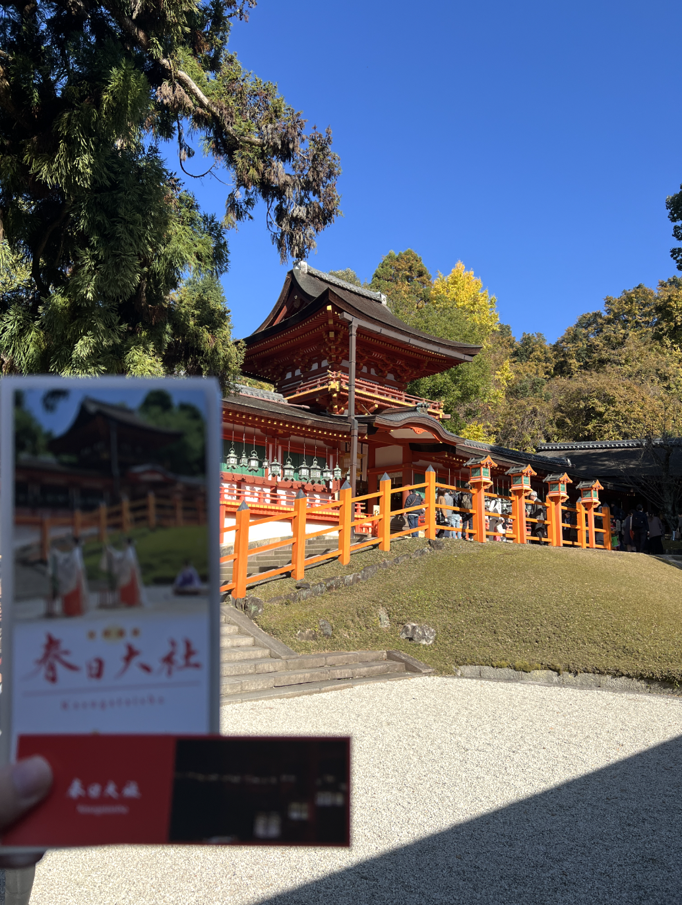
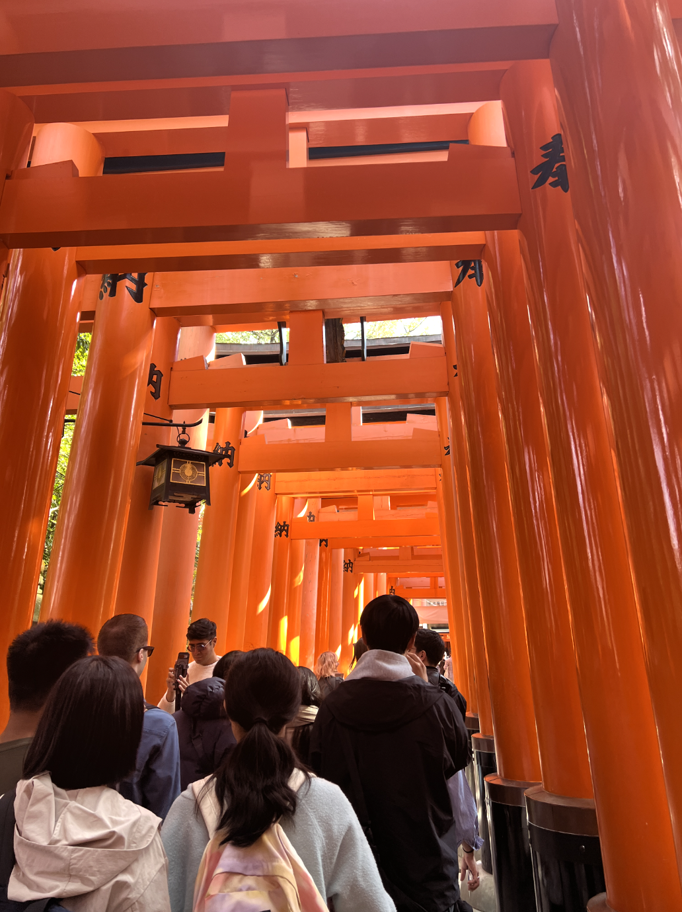
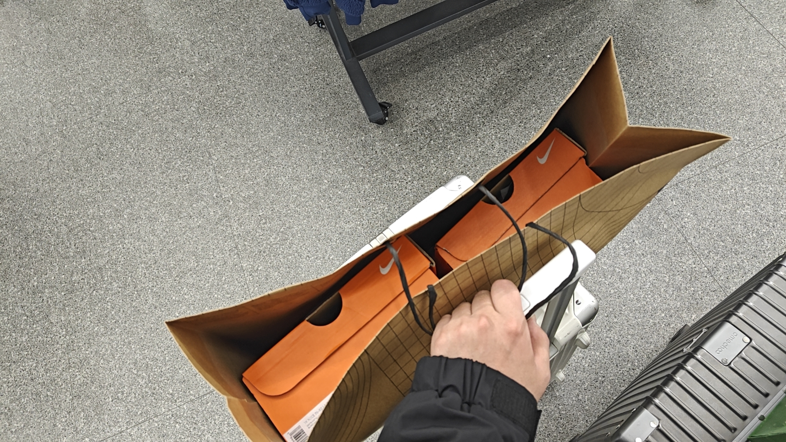

## Day 1 - 大阪

当天很早就出发了，先乘坐6:30温州龙湾起飞的航班抵达上海浦东，再乘坐10:05起飞的航班，在当地时间13:30前落地了关西空港。

 

折腾流量卡、等待托运行李、兑换ICOCA卡浪费了不少时间。

  

然后搭乘南海机场线/南海本线抵达大阪南海难波站，换乘（在难波站迷路了好久）御堂筋线抵达本町站，终于在傍晚入住THE BASEMENT HOTEL Osaka Honmachi酒店。这个酒店是2025年新开的，评价很不错，地理位置也很好（本町距离大阪的知名景点都很近，但缺点是经常需要换乘）。

  

办理完入住后赶紧去happy hour补给一下，看一眼高层的风景便准备出发，开始正式的旅程！

 

第一站打算先去东边的大阪城公园，顺便打卡一下大阪府警察总部，但是失算了！其一，出门的时候天还是比较亮的，抵达的时候就完全暗下来了，而且阪城公园周边的路几乎没有路灯非常暗，导致体验一般；其二，被天气预报被刺了，因为确定不会下雨所以没有带伞，结果刚到天守阁脚下便开始下起了大雨，无奈只能在匆匆拍两张照片后可怜地躲进旁边的大阪城Miraiza避雨。

  

旅程开了个坏头，趁着雨渐小赶回了酒店，休息片刻雨停后去寻找晚饭。我们步行前往心斋桥，最终选择了在PARCO B2食堂街的new SUSHI center。尝了一下在寿司郎一直没有吃到过的安康鱼肝，感觉一般般；但是被乌贼刺身惊艳到了，又追加了一份。其他的料理都很不错（但并没有非常出色），不过价格不贵，性价比非常高。吃完晚饭差不多在19:30，PARCO和旁边的大丸接近关门（为什么心斋桥附近的店都关得特别早），所以没有时间逛宝可梦中心和montbell了，提前埋下伏笔。

  

惦记着UNIQLO感谢祭折扣的ddl，在心斋桥的UNIQLO买了一些衣服，免税后的价格还是非常美丽的。在道顿堀格力高广告牌下简单打卡后，找了家看起来还不错的奶茶店（Koi Thé）买了一杯奶茶，味道一般般（但是要560日元，好贵）。

  

说实话我到现在都没有分得很清心斋桥和道顿堀各自的范围和边界，总之就当是一块区域好了，到处瞎溜达。

  

路过法善寺横丁，这里有一尊水卦不动明王，顺便也浇个水吧。附近的夫妇善哉在之前也标记了，但是遗憾没有胃口再吃了。最后随便逛了逛附近的一家bookoff，第一天的行程就结束了！回到酒店果然得泡一泡浴缸，非常舒服，不过泡久了会有些头晕。今天一开始不太顺利，但是初来异国也大致熟悉了交通、购物之类的流程，后面就越来越轻车熟路了。

  

## Day 2 - 大阪

朋友不怎么爱吃早饭，所以我一般都会提前一天在便利店买好饭团对付一下。日本便利店的饭团真的很好吃，尤其是豆皮饭团和明太子饭团深得我心。今日的行程主要集中在大阪南边动物园前站那一带，以及弥补昨天PARCO的大丸关门太早没完成的遗憾。从本町出发，搭乘中央线换乘谷町线，在四天王寺前夕阳丘站下车，然后步行前往四天王寺。四天王寺的寺院是免费开放的，不过中心庭院（包括中心伽蓝、五重塔等）的参观需要800日元的参拜券。

  

从四天王寺到通天阁还需要步行15到20分钟，如果愿意绕一绕路的话还可以参观一下天王寺和阿倍野（似乎晚上的观景台风景很不错）。

 

通天阁需要提前预约，不过淡季在现场预约也是完全没问题的。一般展望台的票价是1000日元，我们追加了500日元一人的特别展望台票。（除此之外，还被宰了1500日元的照片...只能当作纪念留下收藏了）

  

我们来的时候人不多，但是一般展望台非常热（密不透风）。通天阁的视野非常好，可以俯瞰整个大阪的城市面貌（可以看到市区的建筑密度非常夸张）。特别展望台供游客拍照打卡的吊台犹豫了半天还是不敢上...太高了。

  

中午打算去新世界本通商店街找点东西吃（后悔没有在通天阁楼下吃便宜的KURA），看小红书和大众点评的推荐选了这家外观看起来很有噱头的元祖炸串总店。

  

结果踩雷了...点了牛杂、大阪烧和一份炸串定食，总计4000多日元，又贵又难吃！

 

下午计划去日本桥一带溜达，主要逛一逛二次元相关的店，主要是骏河屋（本馆和别馆）、Animate（本馆），还逛了kids land、jungle、K-BOOKS、空想的机械馆等等。逛得非常爽，但是基本没有什么消费...买了点中古挂件，还扭了几次蛋（一般在300到500日元一次，还是蛮贵的）。

> 日本桥附近的厕所很少，注意一下joshin和kids land的位置吧。

 

逛了一整个下午，因为前不久才刚看完EVA的旧TV版和新剧场版，在空想的机械馆驻足了好久...尤其是下面最左边的绫波丽，真的很好看。但是对比了一下国内的市场价，似乎在这里买没有什么性价比，所以就只是隔着橱窗看看...

  

傍晚在难波肉剧场点了一份烤肉丼定食，花费2130日元（追加了一份肉，味增汤和冰乌龙茶），味道和性价比还是不错的。晚上又回到了心斋桥，在堂吉柯德没有找到姐姐拜托代购的富士拍立得相纸，接着就去大丸完成昨天没来得及完成的遗憾，逛了宝可梦中心、jump shop和montbell（但是逛montbell的时候又即将打烊了，只能急匆匆地看一眼）。

  

正值御堂筋大道上有限定的光之饗宴event，两侧街道都被包装得很有氛围，于是就从大丸一路溜达回酒店。回到酒店后清点了一下今天的“战利品”，然后就去用精灵球浴球泡澡。浴球全部溶解后里面有一只随机宝可梦（我开出了赛富豪，朋友开出了谜拟丘），需要注意的是这似乎是为数不多的非免税商品（看购物发票时发现），所以就可以放心在日本国境内使用了。

  

## Day 3 - 京都

由于正值红叶季和周末，京都的住宿价格翻了好多倍，导致原定于在京都住两晚的计划改为了两天乘坐电车往返京都的行程。所以今天定了五点半的闹钟很早就起床赶电车了，希望能在清水寺人多起来前尽可能早地抵达。我们乘坐中央线，在堺筋本町换乘堺筋线/阪急千里线（可能需要在淡路站换乘到准特急）到乌丸站，再从四条高仓搭乘八条口207 City Bus抵达清水道，再步行前往清水坂大约需要一个小时四十分钟（880日元并不贵，但是要是坐JR特急就会贵很多）。

  

进入清水寺参拜需要500日元的门票，不幸的是内部的地主神社当天因为维护没有开放。这里的红叶开得非常盛，很有“唐红的恋歌”感，但因为前两天的“暴走”行程和今天的赶早，实在是有些体力不支了。

  

大约八点多就会开放御守和御神签的售卖窗口，我买了开运樱铃、金运守、御守护、缘结守和幸守（开启了奇怪的御守按钮，但我是真的喜欢这些小玩意，也为后面买各种御守埋下伏笔），然后进行了一次100日元的御神签，结果是半吉。

  

大约八点半参观完清水寺，接着去二年坂三年坂溜达溜达，不过时间太早了大多数店都还没开始营业。这里有一家装修非常日式的星巴克，但是挤满了白人。

 

实在是又饿又累，想找个地方坐下歇会，于是就随便选了一家咖啡店てしごとのみせ mokumoku点了一份brunch咖啡定食，但是...如图所示，并不好吃，不建议去。

 

太累了，不想再绕路走到八坂神社，于是去了和祗园花见小路顺路的建仁寺。因为来得还是太早了，花见小路也显得非常冷清，很多店铺都还没有开张。建仁寺需要800日元的门票，需要脱鞋进入，地板凉凉地很冰，不过被太阳晒过的地方很暖。在中心庭院里坐着休息，眼前的景象非常能让人宁静，庭院内的园林造景也非常好看。

> 不得不提一下，建仁寺的厕所非常之整洁舒爽。

 

接着路过鸭川，步行前往一兰（京都河原町店）吃一下心心念念的拉面。因为是第一次吃，所以点的口味比较保守，在自助机器上下单了一个加面、叉烧和盐烧蛋的suite（但是没有给我蛋啊喂），后面额外追加了一个蛋和饭。不得不说，吃完面后用剩下的汤泡饭简直是仙品，属于是油、盐、碳水混合的爆炸享受。

  

然后去伊藤久右卫门（祗园四条店）享用甜品和购买伴手礼，这家店和宇治店是差不多的。伴手礼方面，回国后才开始享用各种抹茶点心，都非常满意，个人比较喜欢的是辻利京らんぐ（像是白色恋人抹茶版）、辻利ラスク、伊藤久右卫门茶游月。支持免税，购物完会赠送一张可以在楼上使用的甜品抵用券（但是我们是在楼上吃完才下来购物的）。

 

然后乘坐京阪本线到出町柳站，步行约十分钟前往下鸭神社，中途会经过鸭川三角洲、鸭川公园、河合神社。下鸭神社是此行下来我最喜欢的神社，可惜很多画面都在Action中（正好不在身边），因此之后有空会再重新上传照片。在下鸭神社买了非常好看的季节限定红叶🍁御守！

傍晚乘坐京阪本线打道回府，回到酒店后，在酒店附近找了一家评价还不错的居酒屋（海鮮屋台おくまん 西本町店）。老板非常热情，邻桌是非常健谈的在日留学生，告诉我们这家居酒屋性价比非常高。最后我们点了5000日元左右十几个菜，直接吃撑...

 

## Day 4 - 兵库

今天计划去兵库县（以姬路市、神户市为主），由于行程比较充实，所以也很早就起来乘车前往姬路市了。我们乘坐四桥线前往西梅田，然后在大阪站换乘东海道/山阳本线，一路经过神户、明石、加古川抵达姬路，前进方向靠左可以清晰地看到濑户内海和明石海峡大桥，非常壮观，单程需要约一个半小时（1860日元，后悔没有购买mini jr pass，一天的往返就够回本了）。

 

今天天气很好，从姬路站下车一路溜达到姬路城，右侧街道可以看到不少姬路城风格设计的井盖。在规划这次兵库行程时，曾犹豫过是否值得大费周章从大阪赶来姬路只为一睹姬路城，当远远看到这座世界文化遗产时我确信，这个选择一定是正确的。

 

不知怎么让我有点想起拉萨的布达拉宫，或许是因为都是白壁之城吧。两者的参观路线类似，都是在建筑物内按照既定的单行线路游走一遍，但我确信姬路城的参观体验要远远更好。入城需要1000日元门票（不久后似乎要涨价至2500日元），我们选择购买了姬路城和好古园的通票（只需要追加50日元）。

 

我们按照游览地图的推荐参观顺序，先在西之丸挺远参观了西之丸御殿（大约需要10到15分钟），然后再去参观天守阁，室内参观是需要脱鞋的，得用塑料袋装着自己的鞋子（所以每个人都会手提一袋鞋子，稍微有些麻烦）。作为木质结构的爱好者，姬路城真的看爽了。

从姬路城出来，前往附近的好古园溜达一下。本来没有抱着什么期望的，没想到里面的秋意很浓，驻足赏枫了许久。

 

回到JR车站前，去姫路城おひざもと しろプリン买了个姬路白壁布丁（520日元），白壁指的大概是讲饼干脆掰碎撒在布丁上，味道很不错。虽然想作为伴手礼带回国，但是这个不好保存，有点可惜。最后，我们去了二阶町的宇奈とと，吃了最普通的鳗鱼饭定食（1000日元）作为午饭。

  

只用一个上午通勤和游玩姬路市的话会比较赶，即使我们很早就出发了，但是到离开姬路时已经是一点半左右了。本来的计划是直接去神户，但我心血来潮，想去明石圣地巡礼一下Fate系列中卫宫士郎的住宅，于是就在明石站和朋友暂时分别。幸运的是织田家长屋门离明石站并不远（大约10分钟以内的路程）。不过还是稍微有些遗憾，时间充裕的话还想去舞子近距离看看明石海峡大桥。

 

抵达神户三之宫站已经是三点半左右了，比预期地晚了好多。打算先去生田神社，然后去北野异人街圣地巡礼一下间桐樱和远坂凛的宅邸。生田神社是结亲良缘、健康守护及安产祈愿的灵验之地，水占很有名但是感觉太麻烦就放弃了，最后在这里买了一块缘结守（会灵验吗.jpg）。

 

然后前往北野异人街，没想到这里的地势非常陡峭，无异于爬山了（向住在这附近的居民致敬）。因为时间仓促，我的行进速度很快，到达鱼鳞之家（间桐邸）时已经满头大汗了。但是门票1100日元，感觉如果只是为了进去简单参观一下没什么性价比，所以就没进去。随后下坡到了风见鸡之馆（远坂邸），很明治和西洋的风格，当天还有一对新人在附近拍婚纱照。

  

傍晚，乘坐92系统巴士到三宫神社站，前往美利坚公园与朋友汇合。正好是蓝调时刻到夜晚的时间，等到抵达美利坚公园海岸时，已经几乎看不见海平面了，残念。匆匆看了一眼神户港塔，我们就去找晚饭了。本来计划的是难得来一次神户，必须得吃一顿神户牛。但看了一圈发现，不仅贵量还少得可怜...最后我们就去三宫站地下商业街（迷路了好久）的京都胜牛吃了个炸牛排定食。一份定食的价格是3619日元，但是量还是好少啊（这个米饭量感觉不够塞牙缝）！

 

最后又是我的私心目的地了，来神户我真的想去看看~东木大桥~神户大桥。从三之宫站乘坐新交通港湾人工岛线前往码头客运站，再徒步穿过神户大桥，抵达港口岛北公园（Port Island Kita Park）。这里已经是在神户空港所在的人工岛了，所以晚上七八点的时间，去向列车一般是空的，回向列车会有很多携带行李的乘客。来这里进行了FZ的圣地巡礼，晚上海边的风很大，需要注意保暖。兵库的一日之旅以神户大桥收尾，最后我们回到三之宫站换乘东海道/山阳本线回到了大阪。

 

## Day 5 - 大阪、奈良

今天我们将从大阪的酒店退房，然后入住位于奈良站附近的温泉酒店，因此今天的行程会比较休闲。本来是打算参观万博纪念公园，但还是临时变了主意。在酒店寄存行李后，先前往了住吉大社。住吉大社是日本两千多家住吉神社的总本宫，也有上千年的历史。

  

反桥的桥面倾斜度有48度，还是很陡峭的。来都来了，就顺便逛一下住吉公园。穿过住吉公园就是一片电线纵横的居民区，风格有些突变，这边有很多当地居民来野餐。

 

接近中午，来到了黑门市场觅食，我们选择在豪快立寿司店吃午饭。海胆感觉没有想象中那么好吃，刺身没有处理得很干净，不过味道还不错，性价比很高。

   

然后在黑门市场里溜达，买了份章鱼烧，但是里面放了红姜，我不喜欢；在高桥豆腐店买了不加糖的冰豆浆，味道上有种说不上来的感觉（毕竟没加糖）。

  

距离奈良酒店的入住还有一些时间，但是也找不到事情干了，于是打算弥补一下第一天的遗憾，又去了一趟大阪城公园，这次看到了白天的大阪府警察本部和天守阁。

 

午后，入住御宿诺诺奈良天然温泉酒店，从奈良站出来走约200米就到了，交通非常便利。酒店的室内都是榻榻米，需要脱鞋进入（提供分趾袜），特色是从下午3点开放到次日上午10点的天然温泉大浴场「吉野樱之汤」。在入住前听闻酒店的早餐非常不错，于是追加了2500日元一人的早餐。

 

酒店的周边设施非常丰富，便利店、药妆店、JR站都很近，步行范围内也有很多评价不错的餐厅。休息到晚上，我们前往するがまちのお好み焼屋打算再吃一次大阪烧。这家店规模不大，由一位慈祥的老太太经营，大约只能同时容纳四到五桌顾客用餐，前来用餐的有很多当地居民和来自世界各地的游客。味道不错，性价比也很高。

  

然后乘坐28系统巴士，来到奈良的montbell。这家montbell很大，二层会给一些旧款式折扣出售（淘了一件格子衫）。还买了一件渔夫帽和stream parka冲锋衣（钱包已流泪）。虽然可以免税，不过会有大约3\%的额外手续费。（不知道为什么montbell不喜欢放英文，被迫拗口地拼各种片假名）

 

返程的巴士间隔半小时才会有一班，刚好步行回酒店的时间也是差不多半小时，于是就一路聊天city walk回去了，晚上的城市非常静谧。回到酒店后当然是体验了一下温泉，享受一下酱油拉面了。

 

## Day 6 - 奈良

虽然要在奈良停留三晚，不过我们只留了一天时间在奈良游玩，因此主线主要是东大寺、奈良公园、春日大社那一带，放弃了药师寺、法隆寺等距离较远的地方。

我们先在酒店享用了美味的早餐（自助的形式），就出发前往兴福寺。从兴福寺开始，就能看到越来越多的鹿群了，不少地方也会有200日元一份的鹿仙贝出售。但一朝被蛇咬，十年怕井绳，年初才刚因为在宿舍被流浪猫抓而打狂犬病疫苗，所以我一天下来都不敢喂鹿，只敢趁别人喂时轻轻摸一下鹿屁股（确保不会被咬）。

 

然后前往东大寺，在路上遇见了非常可爱的小鹿。东大寺的外立面看起来真的非常大气，不愧是世界文化遗产。

  

一路上还遇到了源源不断的小学生、中学生团体前来教学参观，打自心底地羡慕哇，我的学生时代只有各种学习。

从东大寺出来，穿过了奈良公园，我们计划去参观春日大社。由于这附近的餐饮没有太多选择，我们在半山腰的水谷茶屋简单吃了一碗天妇罗乌冬，虽然形式简单，但是味道很不错。春日大社由于社内禁止摄像，所以没有更多相片，只能说非常好看。

  

然后我们来若草山，原本以为只是一个小土坡，没想到意外被卷入了一场累死累活的爬山中。最后拼了老大劲爬过了山顶，上面的风景还是很不赖的。

> 每年一月的第四个土曜日有若草山烧山祭，这附近的时间会进行封山

 

本来是想在这里等待日落的，但是距离日落还有两个小时，实在是等不住就先下山了。下山后从春日大社前的表参道一路走到一之鸟居，那一段路还是非常静谧的，或许感受到了一丝禅意（？）。

 

下山后赶在中谷堂打烊前吃到了有名的抹茶麻薯，早上经过的时候还没开始营业。晚上来到竹之馆吃关东煮，这家店比想象中要有名得多，一般是需要提前预约的，当天walk in很幸运在预约顾客来之前可以占用一张桌子。菜单有些看不懂，索性要了下面一排的所有东西，有点小贵，味道中规中矩，还不错啦算是。回酒店前在罗森买了豆皮饭团、鲑鱼饭团和天津饭，这个速食天津饭真的超难吃。

  

## Day 7 - 京都

今天原定的计划是上午先去京都参观伏见稻荷大社，下午去宇治游玩，买一些伴手礼，品尝抹茶下午茶和欣赏宇治川。但是半路发现身体不太舒服，因此参观完伏见稻荷大社后就先和朋友分别，乘坐近铁线返回奈良了。

乘坐JR奈良线抵达稻荷（Inari）站，终于见到了二次元心中的圣地——伏见稻荷大社！刚抵达正殿时刚好在举行不知道是什么的仪式，虽然不知道有什么含义，不过看起来很庄重神圣。

 

伏见稻荷大社是三万多座稻荷神社的总本宫，位于稻荷山的山麓，所以...果不其然又来爬山了，好累！同时，很佩服人们能将这么多鸟居修建在山上。

  

从稻荷山下来，已经感觉到了身体有一些不适，下午应该是没有能支撑我去宇治折腾的力气了，于是就在京都站内的PLUSTA把想买的伴手礼给买了（需要注意这家店不免税）。然后和朋友一起去了一兰拉面（乌丸店）再吃了顿一兰，就先回奈良了。

  

因为担心第二天发高烧而上不了飞机，在酒店附近的药妆店买了个电子体温计（2700日元左右，滴血），早知道就把体温计带到随身行李中了，本来以为用不上的。

## Day 8 - 大阪

返程日!check out后，我们扛着行李，乘坐大和路线/大阪环状线在新今宫换乘南海线向关西空港方向前进。航班是在下午两点，因此我们计划先在临空城下车，逛一下奥特莱斯。这边的运动品牌虽然大多不能免税，但是价格还是相交国内非常有优势，买了几双作为伴手礼。时间有限，不能临空港的白玉滨海滩悠闲地看海，得赶往机场了。

 

最后在机场711买了便利店非常好吃的布丁带回去给姐姐尝尝，此行关西之旅完美谢幕——

 

## 尾声

好累！整理照片，回忆旅程，动笔写博客花了好几天的时间。这次关西之旅真的很开心，旅行途中还用Action记录了很多（约200G）的第一人称画面，等有空了会在挑选和整理后以合适的方式上传。

主要拍摄设备：一加 Ace 3、DJI Action 5 Pro

旅行规划地图：[Goole Map - Kansai](https://www.google.com/maps/d/u/1/edit?mid=1Q0rBmhST-84xXC4tKXzETUPXUNogr4I&usp=sharing)（在旅行前做的规划地图，标记了一下计划或可能去的地方）

<iframe src="https://www.google.com/maps/d/u/1/embed?mid=1Q0rBmhST-84xXC4tKXzETUPXUNogr4I&ehbc=2E312F" width="640" height="480"></iframe>